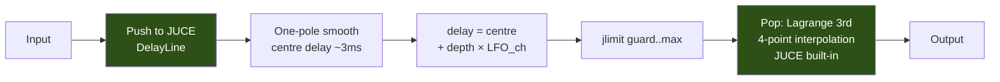
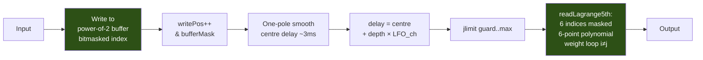
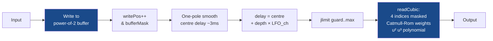
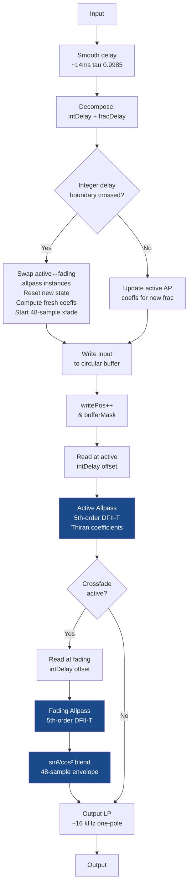
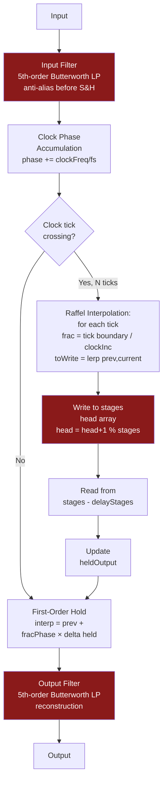
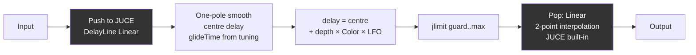
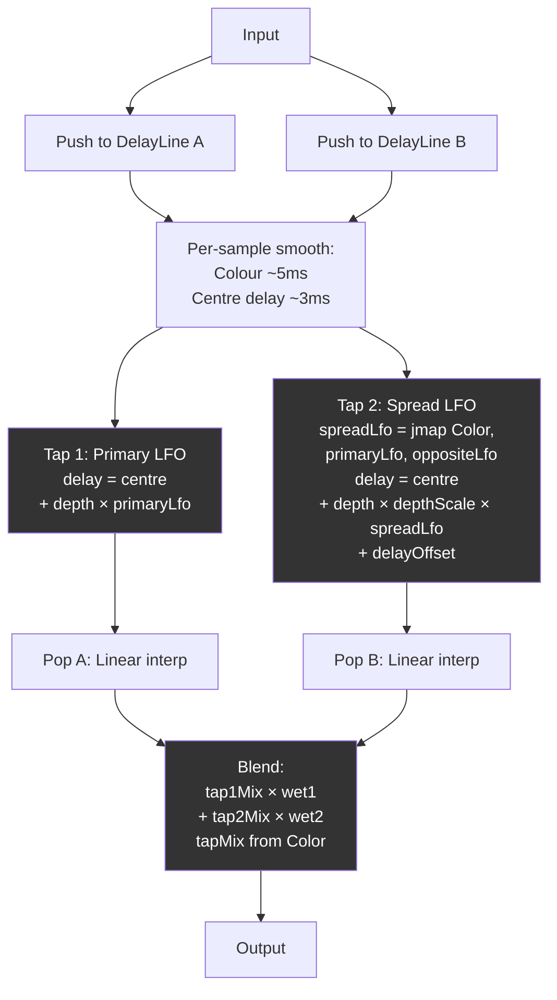

# Choroboros v2.05 — Core Topology Audit & DSP Flow Charts

All 10 cores (5 engines × 2 modes) mapped, audited, and benchmarked.

---

## Outer Signal Chain (ChorusDSP::process)

```mermaid
flowchart TD
    IN[Input Block] --> HPF[HPF 30 Hz\nIIR Butterworth]
    HPF --> PRE_SAT[Pre-Chorus Saturation\ncurrently bypassed]
    PRE_SAT --> CHORUS[processChorus]
    
    subgraph CHORUS_INNER [processChorus]
        direction TD
        PARAMS[Smooth Params:\nDepth rate-limited 2%/s\nRate, Mix, Color, Offset] --> LFO[Generate LFO\nsin + cos quadrature\nPhase offset rotation]
        LFO --> DRY_HOLD[dryWet.pushDrySamples\nhold dry copy]
        DRY_HOLD --> PRE_EMPH[Pre-Emphasis\n3 kHz peak boost\nadaptive: quiet signals only\nSkipped for Red NQ]
        PRE_EMPH --> CORE_SEL{Active Core\n10 options}
        CORE_SEL --> CORE[Core processDelay\nsee per-core charts]
        CORE --> WET_CHAR[Wet Character\nGreen=Bloom\nBlue=Focus\nOthers=pass]
        WET_CHAR --> POST_SAT[Post-Chorus Saturation\nRed NQ only: Color→drive]
        POST_SAT --> DW_MIX[Dry/Wet Mix\nequal-power crossfade]
        DW_MIX --> PEAK[Peak Catcher\ncompressor -6dB thresh\n4:1 ratio, 2dB knee\n50ms atk / 200ms rel]
        PEAK --> TRIM[Output Trim ±12 dB\nsmoothed]
    end
    
    CHORUS --> LPF[LPF 20 kHz\nIIR Butterworth]
    LPF --> WIDTH[Width M/S\nside *= width\nRMS comp: 1/√(0.5+0.5w²)]
    WIDTH --> LIMITER[Safety Limiter\n5ms lookahead\n4× true-peak detect\n-1.0 dBTP thresh\n20:1, 2dB knee\n50ms release]
    LIMITER --> OUT[Output]
```

---

## Core 1: Green NQ — Lagrange 3rd



**Properties:** 2-sample guard. JUCE DelayLine handles buffer management. Simplest core — minimal aliasing risk, no feedback, no nonlinear processing.

---

## Core 2: Green HQ — Lagrange 5th



**Properties:** 3-sample guard. Manual circular buffer. 6-point polynomial per sample (heavier CPU). Power-of-2 + bitmask — no modulo.

---

## Core 3: Blue NQ — Cubic (Catmull-Rom)



**Properties:** 2-sample guard. Structurally identical to Green HQ but with 4-point Catmull-Rom instead of 6-point Lagrange. Same buffer pattern.

---

## Core 4: Blue HQ — Thiran Allpass



**Properties:** 6-sample guard (ORDER+1). Dual-allpass crossfade prevents clicks at integer boundaries. Thiran coefficients recomputed per-sample (inner product loop — heaviest CPU of all cores). 16 kHz output LP tames HF ringing.

---

## Core 5: Red NQ — BBD (Bucket-Brigade Device)



**Properties:** 1-sample guard. BBD clock-domain processing (discrete S&H). 5th-order Butterworth pair brackets the stage chain. Clock frequency tracks delay modulation. Raffel-style sub-sample input interpolation. First-order hold on output (~40 dB clock harmonic suppression). Color drives post-saturation (in outer chain, not inside core).

---

## Core 6: Red HQ — Tape Varispeed

```mermaid
flowchart TD
    IN[Input] --> SAT[tapeSaturate\ntanh soft clip\ndrive from Color]
    SAT --> WRITE[Write to\ncircular buffer]
    WRITE --> ADV[writePos++\n& bufferMask]
    
    ADV --> WOW[Wow: sin(2π·wowPhase)\n× wowDepth × depth\n~0.33 Hz]
    WOW --> FLUTTER[Flutter: sin(2π·flutterPhase)\n× flutterDepth × depth\n~5.8 Hz]
    FLUTTER --> LFO_MOD[LFO modulation\nsmoothed]
    LFO_MOD --> RATIO[Target ratio:\n1.0 + lfo + wow + flutter\nclamped 0.96..1.04]
    RATIO --> SMOOTH_R[Smooth ratio\n~4ms alpha]
    SMOOTH_R --> PHASE[Phase integrator:\noffset += 1 - ratio]
    PHASE --> SPRING[Leaky integrator\noffset *= damping\n0.99999 anti-windup]
    SPRING --> EFF_D[Effective delay =\nfixedDelay + offset\nclamped]
    
    EFF_D --> HERMITE[Hermite Interpolation\n4-point, tension param\ncircular read]
    HERMITE --> TONE[Tone: 2-pole cascaded LP\n~14 kHz, no allocation\nblend: wet + amount×(toned-wet)]
    TONE --> OUT[Output]
    
    style SAT fill:#8a1a1a,color:white
    style HERMITE fill:#8a1a1a,color:white
    style TONE fill:#8a1a1a,color:white
```

**Properties:** 4-sample guard. Write-path saturation (tanh). Varispeed model with leaky phase integrator — physically motivated. Wow + flutter add organic modulation. Hermite tension parameter shapes interpolation character. 2-pole tone filter (zero allocation).

---

## Core 7: Purple NQ — Phase Warp

```mermaid
flowchart LR
    IN[Input] --> WRITE[Write to\npower-of-2 buffer]
    WRITE --> ADV[writePos++\n& bufferMask]
    ADV --> PHASE[Phase accumulate:\nphase += rate/fs\nwrap at 1.0]
    PHASE --> WARP[Warped modulation:\nφ_w = φ + a·sin(k·φ + b·sin(φ))\nmod = sin(φ_w)]
    WARP --> MOD[delay = centre\n+ depth × mod]
    MOD --> SMOOTH_D[SmoothedValue\n10-30ms ramp]
    SMOOTH_D --> CLAMP[jlimit guard..max]
    CLAMP --> READ[readCubic:\nCatmull-Rom 4-point]
    READ --> OUT[Output]
    
    style WARP fill:#6a1a8a,color:white
    style READ fill:#6a1a8a,color:white
```

**Properties:** 2-sample guard. Uses its own phase accumulator (not outer LFO). Nonlinear phase warping formula creates complex, non-sinusoidal modulation. a, b, k all scale with Color. Catmull-Rom interpolation (same as Blue NQ). SmoothedValue for delay (vs one-pole in others).

---

## Core 8: Purple HQ — Orbit

```mermaid
flowchart TD
    IN[Input] --> WRITE[Write to\npower-of-2 buffer]
    WRITE --> ADV[writePos++\n& bufferMask]
    
    ADV --> P_ACC[3 Phase accumulators:\nphase, theta, theta2\neach += rate/fs, wrap 1.0]
    
    P_ACC --> MOD1[Tap 1: Ellipse projection\nu1 = sin(φ)·cos(θ+offset)\n+ (1-e)·cos(φ)·sin(θ+offset)]
    P_ACC --> MOD2[Tap 2: Second ellipse\nu2 = sin(φ)·cos(θ2+offset)\n+ (1-e2)·cos(φ)·sin(θ2+offset)]
    
    MOD1 --> D1[delay1 = centre\n+ depth × u1]
    MOD2 --> D2[delay2 = centre\n+ depth × u2\n+ extra offset]
    
    D1 --> SMOOTH1[SmoothedValue ~20ms]
    D2 --> SMOOTH2[SmoothedValue ~20ms]
    
    SMOOTH1 --> READ1[readCubic tap 1]
    SMOOTH2 --> READ2[readCubic tap 2]
    
    READ1 --> MIX[Blend taps:\nmix1·wet1 + mix2·wet2\nmix ratio from Color]
    READ2 --> MIX
    MIX --> OUT[Output]
    
    style MOD1 fill:#6a1a8a,color:white
    style MOD2 fill:#6a1a8a,color:white
    style MIX fill:#6a1a8a,color:white
```

**Properties:** 2-sample guard. Dual-tap ensemble from single buffer. 2D elliptical orbit with rotating projection axis — creates non-repeating modulation patterns. 3 independent phase accumulators. Per-channel stereo theta offset. Color controls tap blend ratio.

---

## Core 9: Black NQ — Linear



**Properties:** 1-sample guard. Simplest interpolation (2-point linear). Color scales depth (unique to Black — in other engines, Color drives saturation, character, or warp). Glide time from runtime tuning.

---

## Core 10: Black HQ — Linear Ensemble



**Properties:** 1-sample guard. Dual delay lines with independent modulation. Color controls: tap2 mix, second tap depth scale, delay offset, and LFO spread (primary↔opposite interpolation). Creates ensemble density without complex interpolation.

---

## Deep DSP Quirks Audit — All Cores

### 🔴 CRITICAL Findings

**C6-A: Float-to-int without NaN guard — Lagrange5th, Cubic, PhaseWarp, Orbit, Tape**

All manual circular buffer cores compute:
```cpp
int i0 = static_cast<int>(readPos);
```
If `readPos` becomes NaN (e.g., from a NaN in the LFO or smoothing chain), `static_cast<int>(NaN)` is **undefined behavior**. The bitmask on indices downstream doesn't save you — the UB has already fired.

This applies to: `readLagrange5th()`, `readCubic()` (in Blue NQ, Purple NQ, and Purple HQ), and `resampleHermite()` (Tape).

**Fix:** Add a NaN guard before the cast:
```cpp
if (std::isnan(readPos)) readPos = 0.0f;
int i0 = static_cast<int>(readPos);
```
Or more defensively, sanitize the delay value before it reaches the read function:
```cpp
delaySamp = std::isnan(delaySamp) ? guardSamples : juce::jlimit(guardSamples, maxDelaySamples, delaySamp);
```

**Severity:** High in theory, low in practice (NaN would require a bug in the LFO or smoothing math to propagate). But a single NaN in a feedback path or during a core switch could trigger this.

---

**C6-B: readPos negative before wrapping — Lagrange5th, Cubic**

```cpp
float readPos = static_cast<float>(writePos) - delaySamples;
while (readPos < 0.0f)
    readPos += static_cast<float>(bufferSize);
```

The `while` loop is safe (converges because delaySamples < bufferSize), but if `delaySamples` were ever > 2×bufferSize (due to a bug), this becomes an infinite loop. The `jlimit` clamp upstream prevents this in practice. **Low risk, acceptable.**

---

### 🟡 DANGEROUS Findings

**D1-A: Thiran coefficient work**

`ChorusCoreThiran::processDelay()` uses **one-pole smoothing** toward `computeCoefficients` targets (not a full double loop every sample). Full `computeCoefficients` still costs ~150 FLOPs when probe **3** snaps coeffs or on integer-hop init.

**D1-B: BBD filter cutoff update every 32 samples — potential allocation**

```cpp
// In ChorusCoreBBD::processDelay, every 32 samples:
chan.inputFilter.setCutoff(newCutoff);
chan.outputFilter.setCutoff(newCutoff);
```

Depends on whether `BBDCascadeFilter::setCutoff` allocates. If it's just coefficient math (likely), it's fine. If it calls `makeCoefficients` returning a heap-allocated `Coefficients::Ptr`, that's a **D1 violation** (allocation on audio thread). Needs verification.

**D8-A: SmoothedValue in PhaseWarp and Orbit**

`PhaseWarp` and `Orbit` use `juce::SmoothedValue` for delay smoothing, calling `setTargetValue()` + `getNextValue()` per sample. This is safe (no allocation), but `setTargetValue()` recalculates the step internally. In contrast, the one-pole smoothers in Green/Blue/Black cores have lower overhead.

**Not a bug** — SmoothedValue is RT-safe in JUCE. But it's inconsistent with other cores.

---

### 🔵 SUBTLE Findings

**S2-A: Denormal risk in BBD stage chain**

The BBD stages array decays toward silence during clock periods with no new input. Very low-amplitude values in the 1024-stage float array can hit the denormal range. `ScopedNoDenormals` is set in the outer `ChorusDSP::process()`, so the FTZ/DAZ flags are active. **Mitigated.**

**S2-B: Denormal risk in Thiran allpass state**

The 5-element `state[]` array in each allpass instance processes through feedback. During silence, these states decay toward denormal territory. Again, `ScopedNoDenormals` covers this. **Mitigated.**

**S2-C: Tape phase offset leaky integrator**

```cpp
phaseOffset *= tapePhaseDamping; // 0.99999
```

This decays very slowly. After 100,000 samples of silence (~2.3s at 44.1k), the offset is still 37% of its peak. If the initial value was very small (1e-20), the decay passes through denormal range. `ScopedNoDenormals` handles this. **Mitigated.**

**S6-A: Lagrange5th weight computation — floating-point precision**

The Lagrange weight loop:
```cpp
weight *= (u - xj) / (xi - xj);
```
When `u` is close to an integer (e.g., `u ≈ 0` or `u ≈ 1`), the numerator `(u - xj)` passes through zero, making some weights very small and others dominate. For 5th-order, this creates 6 multiplied terms — accumulated round-off can produce interpolation overshoot of ~0.001 dB. **Inaudible, acceptable.**

**S-NEW-A: Thiran coefficient stability at low fractional delay**

When `fracDelay` approaches 0, the Thiran `D` value approaches `ORDER` (5.0). The coefficient formula has a `prod *= num/den` where `den` can become very small when `D - N + k + n ≈ 0`. The `jlimit(ORDER + 0.01, ORDER + 0.99, D)` clamp prevents the worst case, but near `D = 5.01`, coefficient accuracy degrades. The crossfade strategy masks this — when the integer delay changes, the allpass resets with fresh state. **Acceptable.**

**S-NEW-B: Tape write-before-read ordering**

In Tape, the input is written to the buffer (`tapeSaturate(in, drive)`) and then the read position is calculated and read. The effective delay is `currentFixedDelay + phaseOffset`. If the effective delay is exactly 0 (which the clamp prevents), the read would return the just-written sample. The minimum delay clamp to 1.0 sample prevents this. **Mitigated.**

**S-NEW-C: BBD clock frequency at extreme depth**

When depth is at maximum and LFO is at peak, `delayMs` hits `delayMinMs` (clamped). Clock frequency = `stages / (2 × delaySec)`. At very short delays, clock frequency can exceed Nyquist/2, creating aliasing in the S&H step. The 5th-order Butterworth input filter attenuates this, but at extreme settings the filter may not fully suppress clock feedthrough. This is *intentional* — BBD circuits have this exact behavior (it's the "character").

---

## Test Vectors for Benchmarking

Based on the audit, these vectors should be measured per core:

| Vector | What it catches | Method |
|---|---|---|
| **Peak output (dBFS)** | Clipping, gain structure | Max absolute sample after processing |
| **True peak (dBTP)** | Inter-sample clipping | 4× cubic Hermite detection |
| **THD+N** | Aliasing, nonlinear artifacts | Sine input → FFT → harmonic ratio |
| **Noise floor** | Denormals, quantization | Process silence → measure RMS |
| **CPU per sample** | Performance regression | rdtsc or steady_clock per block |
| **NaN/Inf count** | UB, numeric instability | Bit-pattern scan of output |
| **Delay accuracy** | Interpolation quality | Impulse → measure peak position |
| **Frequency response** | Filter coloration | White noise → FFT magnitude |
| **Stereo balance** | Width/panning errors | L vs R RMS ratio |
| **Gain range (min/max)** | Over full param sweep | Sweep all 6 params, record extremes |
